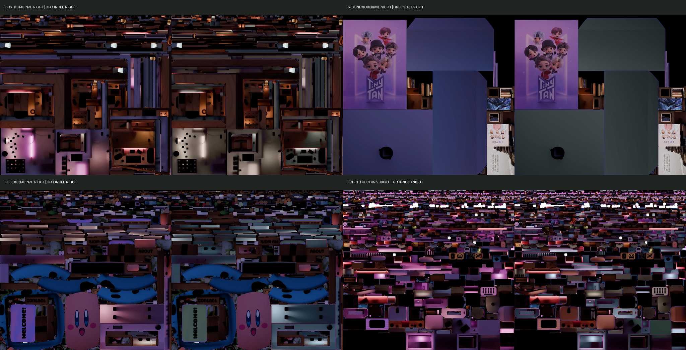
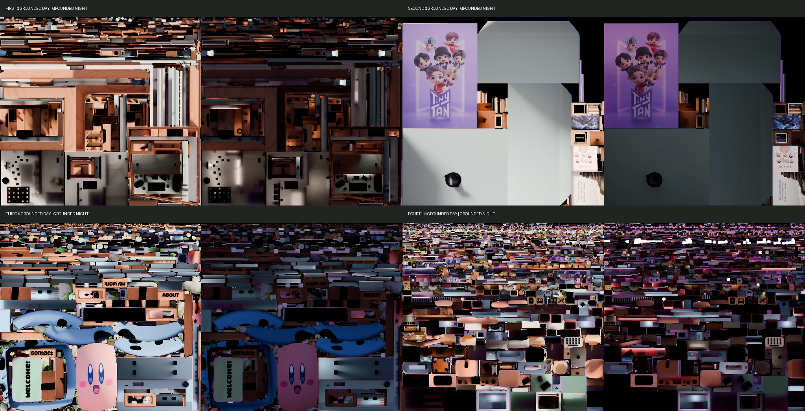

# Báo cáo review Grounded Pastel — Day ↔ Night hoàn chỉnh

Ngày thực hiện: 2026-09-02  
Trạng thái: **ĐÃ TẠO ĐỦ 4 NIGHT TEST VÀ NỐI LOCAL — DỪNG TRƯỚC PRODUCTION**

## Kết luận ngắn

- Bốn Grounded Pastel Day atlases đã duyệt được giữ nguyên byte-for-byte.
- Đã tạo đủ bốn Grounded Pastel Night **test** từ đúng bốn Night production gốc; không darken Day texture và không bake Blender.
- Toàn bộ 15 Day UV masks đã được tái sử dụng ở chế độ read-only sau khi xác minh kích thước, UV/object membership và Night overlay.
- Không cần tạo bất kỳ Night-specific mask nào.
- Baked Night luminance, shadow, AO, lamp glow, highlight, local contrast và texture detail được bảo toàn; chỉ chroma trong mask được điều chỉnh.
- Cả 8 Day/Night test atlases hiện được nối tạm vào website local.
- `npm run build`: **PASS**; trang chính và cả 8 test URLs trả `HTTP 200`.
- Không sửa shader, `uMixRatio`, transition duration, theme logic, UI, animation, raycaster, hover/click, GLB, Blender, geometry, UV hoặc production texture.
- 8/8 production atlases và 3/3 Blender source khớp SHA-256 với backup; production GLB không đổi so với `HEAD`.
- Đã dừng trước promotion/replacement production theo yêu cầu.

## 1. Night source of truth và phương pháp

Nguồn của từng test là production Night tương ứng:

| Atlas | Source production Night | Source SHA-256 |
| --- | --- | --- |
| First | `public/textures/room/night/first-texture-set-night.webp` | `6B44890BA675F52A2AD2481497A2679FC2BB82D761686EE6D90B9199E5E4343E` |
| Second | `public/textures/room/night/second-texture-set-night.webp` | `F38137E567F2114C7835976ED7ABB3E795FA073AF9F0FEDAC384A2B024AB04B9` |
| Third | `public/textures/room/night/third-texture-set-night.webp` | `AA37C8CC097B78E2F775EDFC382700C2E0D46B6ADF894F521160E56B4EB9B46B` |
| Fourth | `public/textures/room/night/fourth-texture-set-night.webp` | `B13702E1A997C215F64C48C49E782D409646DD5DF232B7101F0657D64290D197` |

Quy trình giống Day đã duyệt:

1. Decode production Night atlas gốc.
2. Chuyển sang CIELAB.
3. Giữ nguyên kênh `L` của Night để bảo toàn lighting/shadow/AO/glow/gradient.
4. Blend riêng `a/b` về target hue theo mask; không phủ flat RGB color.
5. Dùng smoothstep Lab `L = 4..18` để bảo vệ true black, screen, glass và deep shadow.
6. Pixel ngoài mask được copy nguyên bản tuyệt đối.
7. Xuất lossless WebP RGB vào test folder; không ghi đè source.

Script tái tạo và metric:

- [`generate_grounded_pastel_night_tests.py`](../scripts/generate_grounded_pastel_night_tests.py)
- [`all-night-test-metrics.json`](../artifacts/grounded-pastel-no-rebake/all-night-test-metrics.json)

## 2. All four Night material/color mappings

### First Night — architecture

| Object/material | Day identity | Night direction |
| --- | --- | --- |
| `Cube` / `Room` | Warm Cream `#F1E9DE` | Warm Dim Cream `#BEB3A5` |
| `Cube.039` / `Stone wall` | Mist Gray `#DCE2DE` | Night Mist Gray `#818D89` |
| `Plane.001` / `Base Gray.001` | Mist Gray `#DCE2DE` | Night Mist Gray `#818D89` |
| `Cube.020` / `Base White.001` | Warm Cream `#F1E9DE` | Warm Dim Cream `#BEB3A5` |

Kết quả: tường/cấu trúc lớn chuyển sang warm-neutral và muted gray, không thành xanh lá. Natural Night wood và vật thể lamp được giữ nguyên; glow chiếu lên bề mặt vẫn giữ luminance gốc.

### Second Night — backdrop/artwork

| Object/material | Day identity | Night direction |
| --- | --- | --- |
| `Backdrop` / `Backdrop.001` | Mist Gray `#DCE2DE` | Night Mist Gray `#818D89` |
| `Plane.122` / `Poster Frame` | Deep Sage `#405D52` | Charcoal Sage `#263C35` |

Poster, photo, illustration và recognizable artwork nằm ngoài mask và giữ đúng pixel production Night.

### Third Night — Dusty Blue anchor

| Object/material | Day identity | Night direction |
| --- | --- | --- |
| `Piano` / `Base Gray.001`, `Piano.001`, `Base Purple.001` | Dusty Blue `#8FA9B8` | Night Dusty Blue `#526C7A` |
| `Plane.019` / `Welcome Mat.001`, `Drawer Shelves.001` | Sage Green `#718E7A` | Night Sage `#4E6759` |

Piano tiếp tục là Dusty Blue thay vì chuyển Sage. Phím đàn, Kirby, plants, rocks, water, natural wood và recognizable props được giữ nguyên.

### Fourth Night — giữ quan hệ với Fourth Day đã duyệt

| Object/material | Day identity | Night direction |
| --- | --- | --- |
| `Plane.030` / `Drawer` | Sage Green `#718E7A` | Night Sage `#4E6759` |
| `Plane.031` / `Drawer Shelves.001` | Warm Cream `#F1E9DE` | Warm Dim Cream `#BEB3A5` |
| `Computer` + `Plane.020` / computer body | Dusty Blue `#8FA9B8` | Night Dusty Blue `#526C7A` |
| `Chair Top` + `Chair Legs` / chair body | Warm Cream `#F1E9DE` | Warm Dim Cream `#BEB3A5` |
| `Chair Top` / `Chair Cushion` | Soft Terracotta `#D99478` | Night Terracotta `#9D6253` |
| `Cube.002` / `Desk Pad` | Soft Terracotta `#D99478` | Night Terracotta `#9D6253` |
| `Cube.003` / keyboard body | Warm Cream `#F1E9DE` | Warm Dim Cream `#BEB3A5` |

Keyboard keys, screen/glass rất tối, natural wood và small colorful props được bảo vệ/giữ nguyên.

## 3. Masks reused from Day

Cả **15/15 masks** có kích thước `4096 × 4096`, khớp Night atlas tương ứng và giữ nguyên hash trong suốt Night workflow:

- First: `room-shell`, `stone-structure`, `neutral-structure`, `cream-structure`.
- Second: `backdrop`, `poster-frame`.
- Third: `piano-body`, `welcome-mat`.
- Fourth: `drawer`, `drawer-shelves`, `computer`, `chair-body`, `chair-cushion`, `desk-pad`, `keyboard-body`.

Cơ sở alignment:

- Day và Night của mỗi texture set cùng kích thước `4096 × 4096`.
- Cùng baked object membership và cùng UV layout đã audit ở Day workflow.
- Theme shader không đổi và dùng cùng `vUv` để sample Day/Night trong mỗi `uTextureSet`.
- Mỗi mask được overlay trực tiếp lên production Night source và kiểm tra lại các UV islands.
- Core overlap giữa các mask trong mỗi atlas: `0 pixel`.

Night alignment overlays được lưu theo mẫu:

`public/textures/room/grounded-pastel-test/debug/<atlas>-night-debug-<group>-overlay.png`

Ví dụ:

- [`First room-shell Night overlay`](../public/textures/room/grounded-pastel-test/debug/first-night-debug-room-shell-overlay.png)
- [`Second backdrop Night overlay`](../public/textures/room/grounded-pastel-test/debug/second-night-debug-backdrop-overlay.png)
- [`Third piano Night overlay`](../public/textures/room/grounded-pastel-test/debug/third-night-debug-piano-body-overlay.png)
- [`Fourth computer Night overlay`](../public/textures/room/grounded-pastel-test/debug/fourth-night-debug-computer-overlay.png)

## 4. New Night-specific masks

**Không có.**

Không mask nào bị force lên layout khác; toàn bộ mask Day đã khớp Night. Các file mask Day không bị ghi lại hoặc chỉnh sửa.

## 5. Four Night test texture paths

| Atlas | Test texture | SHA-256 | Size |
| --- | --- | --- | ---: |
| First | [`first-texture-set-night-grounded-test.webp`](../public/textures/room/grounded-pastel-test/first-texture-set-night-grounded-test.webp) | `B7F61574BACFFE4B8EE7BB084A3CD67E3BCE5B6E345E98E23D8EB2A749930043` | 3,214,992 bytes |
| Second | [`second-texture-set-night-grounded-test.webp`](../public/textures/room/grounded-pastel-test/second-texture-set-night-grounded-test.webp) | `0AB8CFEDB5AC991E25DCCDD998A9AD439F53F885540B7F2469ECF32305D0CCFA` | 1,768,194 bytes |
| Third | [`third-texture-set-night-grounded-test.webp`](../public/textures/room/grounded-pastel-test/third-texture-set-night-grounded-test.webp) | `4896DC82D24924ABADC56DCF98B1F061F0A1F10BFC2F845A59E1B7947198BB0B` | 3,651,774 bytes |
| Fourth | [`fourth-texture-set-night-grounded-test.webp`](../public/textures/room/grounded-pastel-test/fourth-texture-set-night-grounded-test.webp) | `1450DE776CD0F4B967C351A28EA0B637C2F0F21CA50C867815A9D430EB1AFB91` | 6,331,136 bytes |

Tất cả là RGB lossless WebP `4096 × 4096`.

## 6. Original Night vs Grounded Pastel Night comparisons

- [`First Night comparison`](../public/textures/room/grounded-pastel-test/debug/first-night-original-vs-grounded-test.png)
- [`Second Night comparison`](../public/textures/room/grounded-pastel-test/debug/second-night-original-vs-grounded-test.png)
- [`Third Night comparison`](../public/textures/room/grounded-pastel-test/debug/third-night-original-vs-grounded-test.png)
- [`Fourth Night comparison`](../public/textures/room/grounded-pastel-test/debug/fourth-night-original-vs-grounded-test.png)
- [`Tổng hợp cả bốn Night atlases`](../public/textures/room/grounded-pastel-test/debug/all-four-night-atlas-comparisons.png)



Quality metrics cho cả bốn atlas:

- Source production Night unchanged: `true`.
- Pixel ngoài masks bị đổi: `0`.
- New black pixels: `0`.
- Removed black pixels: `0`.
- New blown-highlight pixels: `0`.
- Mask overlap: `0`.
- Không tạo alpha/transparency mới.
- Luminance correlation theo group: `0.999651710` đến `0.999997159`.
- Luminance MAE theo group: `0.013869` đến `0.118520` trên Lab L 0–100.

Ảnh comparison và overlay không cho thấy seam/bleeding/black patch mới. Final seam trên mesh WebGL vẫn cần visual review trong local scene.

## 7. Day/Night consistency findings

Ảnh tổng hợp:

- [`All four Grounded Day vs Night`](../public/textures/room/grounded-pastel-test/debug/all-four-grounded-day-night-consistency.png)



Kết quả theo visual identity:

- First architecture: Warm Cream/Mist Gray → warm dim neutral/Night Mist Gray; không chuyển xanh lá.
- Second backdrop: Mist Gray → charcoal-neutral; artwork giữ nguyên và vẫn nhận diện được.
- Third piano: Dusty Blue → dark Dusty Blue; không đổi sang Sage.
- Third welcome mat: Sage → darker Sage.
- Fourth drawer: Sage → darker Sage.
- Fourth computer: Dusty Blue → muted dark Dusty Blue.
- Fourth chair: Cream/Terracotta → warm dim Cream/Night Terracotta.
- Natural wood giữ baked Night warmth.
- Small colorful props tiếp tục nhiều màu, nên Night không thành monochrome green/gray.

Bốn approved Day test hashes trước/sau Night workflow đều giống nhau:

| Atlas | Approved Day test SHA-256 | Unchanged |
| --- | --- | --- |
| First | `732BC3D069221F98AE1A780D4A79EF9E885A387E2564731DBE58C1EDC29015B5` | Yes |
| Second | `E89D583DC0E13A7B6549920DA7EAEFC024C1BE6C489A95FABAD3DE5D086E3A9F` | Yes |
| Third | `821376D56769AD01B96AC342B51950BD8B9222F7AAEA3B3317F83763E3C8463A` | Yes |
| Fourth | `976965082C2FAFA4F865B54BA35AC21B04DE7435142CE3051049D547FC92EE8F` | Yes |

## 8. Transition findings

Transition được mô phỏng đúng kiến trúc shader hiện tại:

1. Decode sRGB texture sang linear RGB.
2. `mix(dayColor, nightColor, uMixRatio)`.
3. `pow(finalColor, 1.0 / 2.2)`.
4. Quan sát tại `uMixRatio = 0.00`, `0.25`, `0.50`, `0.75`, `1.00`.

Preview strips:

- [`First transition strip`](../public/textures/room/grounded-pastel-test/debug/first-day-night-transition-strip.png)
- [`Second transition strip`](../public/textures/room/grounded-pastel-test/debug/second-day-night-transition-strip.png)
- [`Third transition strip`](../public/textures/room/grounded-pastel-test/debug/third-day-night-transition-strip.png)
- [`Fourth transition strip`](../public/textures/room/grounded-pastel-test/debug/fourth-day-night-transition-strip.png)

Kết quả định lượng trong union masks:

| Atlas | Intermediate purple overshoot | Purple flash detected |
| --- | ---: | --- |
| First | 0.000000% | No |
| Second | 0.000000% | No |
| Third | 0.000000% | No |
| Fourth | 0.000000% | No |

Không thấy mask pop, hue-family swap hoặc saturation jump trong các transition strips. Fourth Night vẫn giữ một lượng nhỏ baked magenta/purple local variation ở vùng rất tối/cạnh mask và các props ngoài mask; đây không phải intermediate flash và không làm các furniture anchor đổi họ màu.

Browser runtime test:

- Đã thử kết nối tới `http://127.0.0.1:5173/` sau build.
- Runtime trả `No browser is available`, giống phase Day trước đó.
- Vì vậy chưa thể click theme toggle và quan sát scene WebGL trực tiếp bằng Codex.
- Transition strips ở trên mô phỏng đúng shader và cung cấp kiểm tra không-browser, nhưng lượt xác nhận cuối về scene, hover/click và cảm giác thời gian chuyển cần bạn thực hiện tại local URL.

## 9. Temporary textureMap configuration

```js
const textureMap = {
  First: {
    day: "/textures/room/grounded-pastel-test/first-texture-set-day-grounded-test.webp",
    night: "/textures/room/grounded-pastel-test/first-texture-set-night-grounded-test.webp",
  },
  Second: {
    day: "/textures/room/grounded-pastel-test/second-texture-set-day-grounded-test.webp",
    night: "/textures/room/grounded-pastel-test/second-texture-set-night-grounded-test.webp",
  },
  Third: {
    day: "/textures/room/grounded-pastel-test/third-texture-set-day-grounded-test.webp",
    night: "/textures/room/grounded-pastel-test/third-texture-set-night-grounded-test.webp",
  },
  Fourth: {
    day: "/textures/room/grounded-pastel-test/fourth-texture-set-day-grounded-test.webp",
    night: "/textures/room/grounded-pastel-test/fourth-texture-set-night-grounded-test.webp",
  },
};
```

Shader vẫn là:

```glsl
vec3 finalColor = mix(dayColor, nightColor, uMixRatio);
```

Không thêm uniform hoặc theme logic mới.

## 10. Build và URL verification

Local preview: `http://127.0.0.1:5173/`

`npm run build`: **PASS** — Vite hoàn tất trong khoảng 3.62 giây.

HTTP result:

- Trang chính: `200`.
- 4 Grounded Pastel Day test assets: `4/4 HTTP 200`.
- 4 Grounded Pastel Night test assets: `4/4 HTTP 200`.
- Tổng texture paths đang dùng: `8/8 HTTP 200`; không có 404.

Hai warning có sẵn vẫn còn:

- `eval` tại `src/main.js:1930`.
- JavaScript chunk lớn hơn 500 kB.

Không có build error. Shader source không đổi; runtime WebGL compile/render chưa thể quan sát trực tiếp vì browser runtime không khả dụng. Diff source chức năng chỉ nằm ở tám đường dẫn trong `textureMap`; raycaster, hover/click, animation, UI và transition code không bị sửa.

## 11. Production integrity

So với `backups/grounded-pastel-phase1-2026-09-01/`:

| Production group | Result |
| --- | --- |
| 4 Day production atlases | `4/4` SHA-256 identical |
| 4 Night production atlases | `4/4` SHA-256 identical |
| `Before Baking.blend` | SHA-256 identical |
| `For Export.blend` | SHA-256 identical |
| `For Night Time Baking.blend` | SHA-256 identical |
| Tổng textures + Blender sources | **11/11 identical** |

Production GLB đang dùng:

- `public/models/room-main.glb`
- SHA-256: `14A17459EB3764F467BBA3B86E02566AEE3E62FD11B5798F9A8743EDEE34CF11`
- Không có diff so với `HEAD`.

Theme shader không có diff so với `HEAD`. Không xóa/sửa backup.

## 12. Regions intentionally preserved

- First: natural wood, physical Lamp object, clock/details và small props; room-wall lamp illumination giữ Night luminance.
- Second: poster art, photographs, illustrations, wooden frames và recognizable image content.
- Third: piano keys, Kirby, plants, seaweed, rocks, water, wooden labels, League logo, microphone và dây tối.
- Fourth: keyboard keys, books, posters, plants, toys, social logos, string lights, natural wood và screen/glass rất tối.
- Mọi pixel ngoài union masks của từng atlas: giữ nguyên tuyệt đối (`0 mismatch`).

## 13. Objects/assignments còn cần visual confirmation

1. Yêu cầu gợi ý “Lamp → Deep Sage” trong mục Fourth, nhưng audit xác nhận object `Lamp` thuộc First atlas, không thuộc Fourth. Day đã duyệt giữ Lamp nguyên bản; để tránh Night-only hue-family change và không phá baked lamp illumination, Night cũng giữ Lamp nguyên bản. Đây là lựa chọn bảo thủ cần bạn xác nhận bằng mắt.
2. First `Cube`, `Cube.039`, `Plane.001` dùng cùng canonical baked masks đã duyệt dù source/baked topology không hoàn toàn bằng nhau. Night overlays khớp đúng structural islands; wood/outlet vẫn bị loại.
3. Third piano mask giữ nguyên giới hạn Day: `1,514/1,516` body target polygons được geometry-match; hai polygon không match tiếp tục giữ nguyên thay vì đoán.
4. `Plane.019` welcome-mat assembly gồm một số island nhỏ cùng object/material; Night overlay xác nhận không chạm Kirby hoặc main piano body.
5. Fourth computer mask giữ screen/glass cực tối bằng luminance gate. Một ít local purple/magenta ở deep shadow/highlight vẫn được giữ để không phá baked atmosphere.
6. Do browser runtime không khả dụng, cảm giác chuyển cảnh trong full 3D room, final seams và interaction behavior vẫn cần visual approval thủ công tại local URL.

## 14. Files changed/created trong Night stage

### Temporary website wiring

- [`src/main.js`](../src/main.js) — bốn Night paths đổi từ production sang Grounded Pastel Night test; bốn approved Day test paths giữ nguyên.

### Night test assets

- 4 Night lossless WebP test atlases trong `public/textures/room/grounded-pastel-test/`.
- 15 Night mask-alignment overlays trong `public/textures/room/grounded-pastel-test/debug/`.
- 4 original-Night-vs-test comparisons.
- 1 all-four-Night comparison sheet.
- 1 all-four Grounded Day-vs-Night consistency sheet.
- 4 shader-equivalent Day→Night transition strips.

### Script, metrics và report

- `scripts/generate_grounded_pastel_night_tests.py`
- `artifacts/grounded-pastel-no-rebake/all-night-test-metrics.json`
- `docs/grounded-pastel-full-day-night-review.md`

Không tạo/sửa Night mask file; không sửa Day test asset.

`dist/` được Vite tạo lại để validation nhưng là generated/ignored output.

## 15. Safe stop

Đã dừng đúng yêu cầu:

- Grounded Pastel Day ↔ Night hoàn chỉnh đang chạy local bằng test assets.
- Chưa ghi đè 8 production textures.
- Chưa bake hoặc sửa Blender.
- Chưa sửa GLB/shader/UI/raycaster/animations.
- Chưa promotion test assets sang production filenames.

**Chờ final visual approval của bạn trước mọi bước production replacement.**
