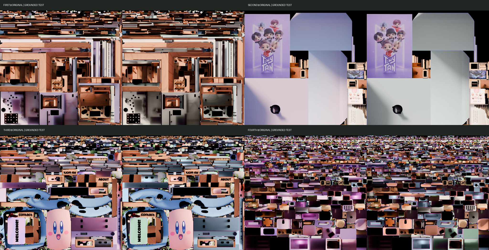

# Báo cáo review Grounded Pastel — toàn bộ Day atlases

Ngày thực hiện: 2026-09-02  
Trạng thái: **ĐÃ HOÀN TẤT BỘ 4 DAY TEST — DỪNG CHỜ DUYỆT; CHƯA XỬ LÝ NIGHT**

## Kết luận ngắn

- Đã tạo test Grounded Pastel cho `First Day`, `Second Day`, `Third Day` bằng đúng quy trình CIELAB giữ luminance đã được duyệt ở `Fourth Day`.
- `Fourth Day` đã duyệt được giữ nguyên byte-for-byte; SHA-256 vẫn là `976965082C2FAFA4F865B54BA35AC21B04DE7435142CE3051049D547FC92EE8F`.
- Cả bốn đường dẫn Day trong `textureMap` hiện tạm trỏ tới test atlas; cả bốn Night vẫn trỏ tới production atlas gốc.
- Không bake, không sửa Blender, GLB, geometry, UV, object name, animation, raycaster, hover/click, UI hoặc shader.
- `npm run build`: **PASS**.
- Trang local và cả 8 URL texture đang dùng đều trả `HTTP 200`.
- 8/8 production room textures và 3/3 Blender source khớp SHA-256 với backup; production GLB khớp `HEAD`.
- Môi trường Codex không có browser runtime khả dụng (`browsers.list()` trả `[]`), nên lượt kiểm tra WebGL trực tiếp trong scene cần được review thủ công tại `http://127.0.0.1:5173/`.

## 1. Phương pháp audit và bằng chứng

Atlas membership không được suy đoán chỉ từ tên. Nguồn đối chiếu gồm:

1. Baked mesh trong collection `SimpleBake_Bakes` của `For Export.blend`.
2. Baked material của từng texture set và UV layer `SimpleBake`.
3. Source mesh/material trong `Before Baking.blend`.
4. `For Night Time Baking.blend` chỉ dùng làm nguồn fallback cho object không còn trong Day source.
5. Production atlas và debug overlay để kiểm tra lại vùng UV trên ảnh thật.
6. `textureSet`/`textureMap` hiện tại trong Three.js.

Audit đầy đủ, gồm material slots, polygon counts, source origin, UV và topology:

- [`remaining-day-atlas-source-audit.json`](../artifacts/grounded-pastel-no-rebake/remaining-day-atlas-source-audit.json)
- [`remaining-day-recolor-uv-polygons.json`](../artifacts/grounded-pastel-no-rebake/remaining-day-recolor-uv-polygons.json)

## 2. First atlas membership

`First` có **24 mesh**, không thiếu object nào:

`Clock`, `Cube.009`, `Cube.016`, `Cube.018`, `Cube.019`, `Cube.020`, `Cube.021`, `Cube.027`, `Cube.028`, `Cube.036`, `Cube.037`, `Cube.039`, `Cube`, `Lamp`, `Plane.001`, `Plane.003`, `Plane.037`, `Plane.039`, `Plane.040`, `Plane.041`, `Plane.063`, `Plane.064`, `Torus.001`, `Vert.012`.

`Plane.003` không còn trong `Before Baking.blend`, nên source material được xác nhận từ `For Night Time Baking.blend`. Baked membership và UV vẫn lấy từ `For Export.blend`.

Phần lớn object trong First là gỗ/khung gỗ và được giữ nguyên. Nhóm được recolor chỉ là các bề mặt kiến trúc lớn, đá và cấu trúc neutral.

## 3. Second atlas membership

`Second` có **5 mesh**, không thiếu object nào:

`Backdrop`, `Plane.042`, `Plane.045`, `Plane.047`, `Plane.122`.

`Backdrop` được xác nhận source material từ `For Night Time Baking.blend`; baked mesh có topology trùng hoàn toàn `21/21` polygon. Ba object `Plane.042`, `Plane.045`, `Plane.047` chứa frame/artwork và được giữ nguyên. `Plane.122` chỉ recolor 4 polygon thuộc material `Poster Frame`; nội dung poster không nằm trong mask.

## 4. Third atlas membership

`Third` có **33 mesh**, không thiếu object nào:

`Kirby`, `League_Logo`, `Microphone`, `Mossy Rock_2`, `Mossy Rock_3.001`, `Mossy Rock_3`, `Mossy Rock_4.001`, `Mossy Rock_4.002`, `Mossy Rock_4`, `Mossy Rock`, `Piano`, `Plane.004`, `Plane.006`, `Plane.016`, `Plane.017`, `Plane.018`, `Plane.019`, `Plane.067`, `Plane`, `Seaweed_10`, `Seaweed_1`, `Seaweed_2`, `Seaweed_3`, `Seaweed_4`, `Seaweed_5`, `Seaweed_6.001`, `Seaweed_6`, `Seaweed_7`, `Seaweed_8`, `Seaweed_9`, `Seaweed`, `Wire_Two`, `Wooden_Name.001`.

`Kirby`, `Plane.004` và `Plane.006` dùng source fallback từ `For Night Time Baking.blend`; cả ba đều cố ý được giữ nguyên. Chỉ thân piano và welcome mat được recolor. Cây, đá, nước, Kirby, logo, microphone, dây và gỗ giữ màu tự nhiên/nhận diện gốc.

## 5. Object/material → target color mapping

### First Day

| Original object/material | New color | Hex | Cách chọn |
| --- | --- | --- | --- |
| `Cube` / `Room` | Warm Cream | `#F1E9DE` | Whole baked object rồi loại chính xác geometry của `Wood` và `Outlet` |
| `Cube.039` / `Stone wall` | Mist Gray | `#DCE2DE` | Toàn bộ baked object đá |
| `Plane.001` / `Base Gray.001` | Mist Gray | `#DCE2DE` | Toàn bộ baked object neutral structure |
| `Cube.020` / `Base White.001` | Warm Cream | `#F1E9DE` | Source polygon index khớp baked topology |

### Second Day

| Original object/material | New color | Hex | Cách chọn |
| --- | --- | --- | --- |
| `Backdrop` / `Backdrop.001` | Mist Gray | `#DCE2DE` | Toàn bộ backdrop, topology `21/21` khớp |
| `Plane.122` / `Poster Frame` | Deep Sage | `#405D52` | 4 polygon của frame; poster artwork bị loại khỏi mask |

### Third Day

| Original object/material | New color | Hex | Cách chọn |
| --- | --- | --- | --- |
| `Piano` / `Base Gray.001`, `Piano.001`, `Base Purple.001` | Dusty Blue | `#8FA9B8` | Geometry-matched source material, `1514/1516` target polygon |
| `Plane.019` / `Welcome Mat.001`, `Drawer Shelves.001` | Sage Green | `#718E7A` | Toàn bộ baked object của welcome mat |

### Fourth Day đã duyệt và được giữ nguyên

| Original object/material | New color | Hex |
| --- | --- | --- |
| `Plane.030` / `Drawer` | Sage Green | `#718E7A` |
| `Plane.031` / `Drawer Shelves.001` | Warm Cream | `#F1E9DE` |
| `Computer` và `Plane.020` / computer body | Dusty Blue | `#8FA9B8` |
| `Chair Top`, `Chair Legs` / chair body | Warm Cream | `#F1E9DE` |
| `Chair Top` / `Chair Cushion` | Soft Terracotta | `#D99478` |
| `Cube.002` / `Desk Pad` | Soft Terracotta | `#D99478` |
| `Cube.003` / keyboard body | Warm Cream | `#F1E9DE` |

## 6. Masks và debug overlays mới

Tất cả mask là `4096 × 4096`, white = vùng recolor, black = giữ nguyên. Mask được rasterize ở 2× rồi downsample Lanczos để antialias cạnh UV.

| Atlas/group | Mask | Coverage | Debug overlay |
| --- | --- | ---: | --- |
| First / Room shell | [`first-mask-room-shell.png`](../public/textures/room/grounded-pastel-test/masks/first-mask-room-shell.png) | 24.197894% | [`overlay`](../public/textures/room/grounded-pastel-test/debug/first-debug-room-shell-overlay.png) |
| First / Stone structure | [`first-mask-stone-structure.png`](../public/textures/room/grounded-pastel-test/masks/first-mask-stone-structure.png) | 5.309856% | [`overlay`](../public/textures/room/grounded-pastel-test/debug/first-debug-stone-structure-overlay.png) |
| First / Neutral structure | [`first-mask-neutral-structure.png`](../public/textures/room/grounded-pastel-test/masks/first-mask-neutral-structure.png) | 8.195478% | [`overlay`](../public/textures/room/grounded-pastel-test/debug/first-debug-neutral-structure-overlay.png) |
| First / Cream structure | [`first-mask-cream-structure.png`](../public/textures/room/grounded-pastel-test/masks/first-mask-cream-structure.png) | 1.391536% | [`overlay`](../public/textures/room/grounded-pastel-test/debug/first-debug-cream-structure-overlay.png) |
| Second / Backdrop | [`second-mask-backdrop.png`](../public/textures/room/grounded-pastel-test/masks/second-mask-backdrop.png) | 56.659681% | [`overlay`](../public/textures/room/grounded-pastel-test/debug/second-debug-backdrop-overlay.png) |
| Second / Poster frame | [`second-mask-poster-frame.png`](../public/textures/room/grounded-pastel-test/masks/second-mask-poster-frame.png) | 0.088423% | [`overlay`](../public/textures/room/grounded-pastel-test/debug/second-debug-poster-frame-overlay.png) |
| Third / Piano body | [`third-mask-piano-body.png`](../public/textures/room/grounded-pastel-test/masks/third-mask-piano-body.png) | 21.329921% | [`overlay`](../public/textures/room/grounded-pastel-test/debug/third-debug-piano-body-overlay.png) |
| Third / Welcome mat | [`third-mask-welcome-mat.png`](../public/textures/room/grounded-pastel-test/masks/third-mask-welcome-mat.png) | 4.489428% | [`overlay`](../public/textures/room/grounded-pastel-test/debug/third-debug-welcome-mat-overlay.png) |

Validation:

- Mask overlap trong từng atlas: `0 pixel`.
- Pixel ngoài union mask bị thay đổi: `0 pixel`.
- Không có neighboring UV island ngoài nhóm mục tiêu bị chọn trong overlay đã kiểm tra.
- Không phát sinh transparent region hoặc alpha channel; source và test đều là RGB.

## 7. Recoloring method

Đúng cùng phương pháp của Fourth Day đã duyệt:

1. Decode atlas production gốc.
2. Chuyển màu sang CIELAB.
3. Giữ nguyên kênh `L` để bảo toàn baked lighting, shadow, AO, highlight và local contrast.
4. Blend hai kênh `a/b` về target color theo từng UV mask; không dùng flat RGB overlay.
5. Bảo vệ vùng rất tối bằng smoothstep ở Lab `L = 4..18`.
6. Giữ pixel ngoài mask nguyên bản.
7. Xuất lossless WebP RGB vào thư mục test, không ghi đè production.

Script tái tạo:

- [`audit_remaining_day_atlases.py`](../scripts/blender/audit_remaining_day_atlases.py)
- [`export_remaining_day_recolor_uv_data.py`](../scripts/blender/export_remaining_day_recolor_uv_data.py)
- [`generate_grounded_pastel_remaining_day_tests.py`](../scripts/generate_grounded_pastel_remaining_day_tests.py)

## 8. Day test texture paths và quality metrics

| Atlas | Test path | SHA-256 | Luminance MAE | Min correlation |
| --- | --- | --- | ---: | ---: |
| First | [`first-texture-set-day-grounded-test.webp`](../public/textures/room/grounded-pastel-test/first-texture-set-day-grounded-test.webp) | `732BC3D069221F98AE1A780D4A79EF9E885A387E2564731DBE58C1EDC29015B5` | 0.081093–0.102306 | 0.999989897 |
| Second | [`second-texture-set-day-grounded-test.webp`](../public/textures/room/grounded-pastel-test/second-texture-set-day-grounded-test.webp) | `E89D583DC0E13A7B6549920DA7EAEFC024C1BE6C489A95FABAD3DE5D086E3A9F` | 0.090404–0.100921 | 0.999968565 |
| Third | [`third-texture-set-day-grounded-test.webp`](../public/textures/room/grounded-pastel-test/third-texture-set-day-grounded-test.webp) | `821376D56769AD01B96AC342B51950BD8B9222F7AAEA3B3317F83763E3C8463A` | 0.093006–0.097101 | 0.999992374 |
| Fourth (approved) | [`fourth-texture-set-day-grounded-test.webp`](../public/textures/room/grounded-pastel-test/fourth-texture-set-day-grounded-test.webp) | `976965082C2FAFA4F865B54BA35AC21B04DE7435142CE3051049D547FC92EE8F` | 0.052311–0.127251 | 0.999966571 |

`Luminance MAE` dùng thang Lab L 0–100. Cả ba atlas mới đều có:

- Source production unchanged: `true`.
- Outside-mask mismatch: `0`.
- New black pixels: `0`.
- Removed black pixels: `0`.
- Kích thước giữ nguyên: `4096 × 4096`.

Metric đầy đủ:

- [`remaining-day-test-metrics.json`](../artifacts/grounded-pastel-no-rebake/remaining-day-test-metrics.json)
- [`fourth-day-test-metrics.json`](../artifacts/grounded-pastel-no-rebake/fourth-day-test-metrics.json)

## 9. Original vs test comparisons

- [`First original vs test`](../public/textures/room/grounded-pastel-test/debug/first-day-original-vs-grounded-test.png)
- [`Second original vs test`](../public/textures/room/grounded-pastel-test/debug/second-day-original-vs-grounded-test.png)
- [`Third original vs test`](../public/textures/room/grounded-pastel-test/debug/third-day-original-vs-grounded-test.png)
- [`Fourth original vs approved test`](../public/textures/room/grounded-pastel-test/debug/fourth-day-original-vs-grounded-test.png)
- [`Tổng hợp cả bốn atlas`](../public/textures/room/grounded-pastel-test/debug/all-four-day-atlas-comparisons.png)



Không thấy bleeding, black patch hay seam mới ở cấp atlas/mask/overlay. Do browser runtime không khả dụng, seam/alignment cuối cùng trên mesh WebGL phải được xác nhận bằng mắt trong local room.

## 10. Vùng cố ý giữ nguyên

### First

- Natural wood: clock/frame/shelf/trim và các object dùng `Wood` hoặc `Light Wooden.001`.
- `Cube` material `Wood` và `Outlet` được geometry-match rồi loại khỏi room-shell mask.
- `Lamp` và accent `Base Blue` được giữ vì đã hợp palette và là chi tiết nhỏ.
- Các chi tiết nhỏ không phải phần kiến trúc mục tiêu được giữ nguyên.

### Second

- Toàn bộ photographs, poster artwork, illustration và recognizable graphics.
- `Plane.042`, `Plane.045`, `Plane.047` cùng wood/photo content.
- Trong `Plane.122`, chỉ `Poster Frame` được đổi; artwork giữ nguyên.

### Third

- Toàn bộ phím piano đen/trắng; material `Base Black.001` và `Base White.001` không nằm trong piano-body mask.
- Kirby, League logo, microphone và các recognizable props.
- Plants/seaweed, outdoor rocks, water và natural environment colors.
- Natural wood (`Plane.004`, `Plane.006`, `Wooden_Name.001`) và dây/stand tối.

### Fourth

- Giữ nguyên toàn bộ vùng đã được duyệt: natural wood, books, poster, plants, toys, social logos, string lights và keyboard keys.

## 11. Phân bổ palette toàn căn phòng

- **Sage Green:** Fourth drawer; Third welcome mat.
- **Deep Sage:** Second poster frame nhỏ.
- **Dusty Blue:** Third piano body; Fourth computer/body. Dusty Blue được dùng ở hai visual anchor khác nhau để cân bằng Sage.
- **Soft Terracotta / Peach:** Fourth chair cushion và desk pad; chỉ đóng vai trò warm accent.
- **Warm Cream:** First room shell và cream structure; Fourth chair body, drawer shelves và keyboard body.
- **Mist Gray:** First stone/neutral structure; Second backdrop.
- **Natural wood:** giữ nổi bật trên First và xuyên suốt room/furniture/frame.
- **Colorful props cố ý giữ:** Kirby, artwork/photos/posters, plants, League logo, microphone, books, sticky notes, toys, social cards, keyboard keys và các props trang trí nhỏ.
- `Muted Yellow` và `Dusty Rose` không bị ép thêm vào bề mặt lớn; chúng tiếp tục xuất hiện tự nhiên ở props/accent hiện có.

Kết quả tổng thể không dồn mọi nội thất sang Sage: architectural surfaces dùng Warm Cream/Mist Gray, hai anchor dùng Dusty Blue, Sage có giới hạn, Terracotta tập trung ở Fourth và wood vẫn chiếm vai trò lớn.

## 12. Temporary textureMap

Chỉ bốn giá trị `day` được đổi đường dẫn; mọi `night` vẫn nguyên:

```js
const textureMap = {
  First: {
    day: "/textures/room/grounded-pastel-test/first-texture-set-day-grounded-test.webp",
    night: "/textures/room/night/first-texture-set-night.webp",
  },
  Second: {
    day: "/textures/room/grounded-pastel-test/second-texture-set-day-grounded-test.webp",
    night: "/textures/room/night/second-texture-set-night.webp",
  },
  Third: {
    day: "/textures/room/grounded-pastel-test/third-texture-set-day-grounded-test.webp",
    night: "/textures/room/night/third-texture-set-night.webp",
  },
  Fourth: {
    day: "/textures/room/grounded-pastel-test/fourth-texture-set-day-grounded-test.webp",
    night: "/textures/room/night/fourth-texture-set-night.webp",
  },
};
```

Theme shader vẫn dùng kiến trúc gốc:

```glsl
vec3 finalColor = mix(dayColor, nightColor, uMixRatio);
```

Không có global tint/recolor uniform. `uMixRatio` và theme-toggle behavior không đổi; khi chuyển Night, room sẽ blend về bộ Night production cũ như dự kiến.

## 13. Build và local verification

Local URL: `http://127.0.0.1:5173/`

HTTP checks:

- Trang chính: `200`.
- First/Second/Third/Fourth Day test: `200` cho cả 4 URL.
- First/Second/Third/Fourth Night production: `200` cho cả 4 URL.
- Không có 404 hoặc broken texture path trong các URL đang được `textureMap` tham chiếu.

`npm run build`: **PASS**, Vite build hoàn tất trong khoảng 4.27 giây.

Hai warning có sẵn vẫn còn:

- `eval` tại `src/main.js:1930`.
- JavaScript chunk lớn hơn 500 kB.

Không có build error liên quan tới texture test. Source code chức năng chỉ khác ở bốn Day texture paths, nên UI layout/animation, raycaster, hover/click và shader không bị thay đổi trong stage này.

Browser QA:

- Đã thử kết nối in-app browser theo đúng local URL.
- Runtime trả `No browser is available`; `browsers.list()` trả `[]`.
- Vì vậy không khẳng định giả tạo rằng đã quan sát được WebGL frame. Vui lòng review trực tiếp local URL để xác nhận final UV alignment/seam/interactions bằng mắt.

## 14. Production integrity

So với backup `backups/grounded-pastel-phase1-2026-09-01/`:

| Production group | Result |
| --- | --- |
| 4 Day production atlases | `4/4` SHA-256 identical |
| 4 Night production atlases | `4/4` SHA-256 identical |
| `Before Baking.blend` | SHA-256 identical |
| `For Export.blend` | SHA-256 identical |
| `For Night Time Baking.blend` | SHA-256 identical |
| Tổng textures + Blender sources | **11/11 identical** |

Production GLB đang được website dùng:

- `public/models/room-main.glb`
- SHA-256: `14A17459EB3764F467BBA3B86E02566AEE3E62FD11B5798F9A8743EDEE34CF11`
- `git diff HEAD`: không có thay đổi.

Theme shader không bị sửa trong stage này và không có diff với `HEAD`. Bản shader trong backup Phase 1 là snapshot trước bước restore nên còn global pink→brown uniforms; khác biệt đó là thay đổi restore đã được chủ động phê duyệt ở phase trước, không phải production corruption.

Không xóa hoặc sửa bất kỳ backup nào.

## 15. Uncertain assignments và giới hạn

1. `Cube` source có 1,110 polygon, baked copy có 1,063. Room-shell mask dùng toàn bộ canonical baked UV rồi geometry-match để loại 778 polygon `Wood` và 1 polygon `Outlet`. 35 baked polygon không match source vẫn thuộc phần whole-object architecture và đã được kiểm tra bằng overlay.
2. `Cube.039` và `Plane.001` có topology source/baked hơi khác, nên mask dùng canonical whole baked object. Overlay xác nhận chúng là stone/neutral structure, không phải wood/artwork.
3. `Backdrop` chỉ có trong Night source nhưng baked topology khớp `21/21`, và overlay xác nhận chỉ vùng backdrop lớn được chọn.
4. `Piano` source có 2,884 polygon, baked copy có 2,883. Geometry mapping xác nhận `1,514/1,516` target body polygon, tức 99.87%. Hai polygon `Base Gray.001` không match bị giữ nguyên; 570 polygon `Base Black.001` và 798 polygon `Base White.001` của keys được cố ý giữ.
5. `Plane.019` có cả `Welcome Mat.001` và `Drawer Shelves.001`; object được recolor toàn bộ vì hai material cùng thuộc welcome-mat assembly. Overlay cho thấy các island nhỏ liên quan thuộc cùng object, không chạm Kirby hay piano body.
6. Kiểm tra atlas/mask không phát hiện seam/bleeding, nhưng final seam/alignment trên mesh và interaction runtime cần bạn xác nhận thủ công vì không có browser runtime trong phiên Codex này.

## 16. Files changed/created trong stage này

### Source tạm cho local preview

- [`src/main.js`](../src/main.js) — First/Second/Third Day chuyển sang test path; Fourth test path đã duyệt được giữ; Night không đổi.

### Test atlases

- `public/textures/room/grounded-pastel-test/first-texture-set-day-grounded-test.webp`
- `public/textures/room/grounded-pastel-test/second-texture-set-day-grounded-test.webp`
- `public/textures/room/grounded-pastel-test/third-texture-set-day-grounded-test.webp`
- Fourth test file được đọc/kiểm tra hash nhưng không sửa.

### Masks/debug

- 8 mask PNG mới: 4 First, 2 Second, 2 Third.
- 8 debug overlay PNG tương ứng.
- 3 ảnh original-vs-test cho First/Second/Third.
- 1 ảnh tổng hợp cả bốn Day atlases.

### Audit/scripts/reports

- `scripts/blender/audit_remaining_day_atlases.py`
- `scripts/blender/export_remaining_day_recolor_uv_data.py`
- `scripts/generate_grounded_pastel_remaining_day_tests.py`
- `artifacts/grounded-pastel-no-rebake/remaining-day-atlas-source-audit.json`
- `artifacts/grounded-pastel-no-rebake/remaining-day-recolor-uv-polygons.json`
- `artifacts/grounded-pastel-no-rebake/remaining-day-test-metrics.json`
- `docs/grounded-pastel-full-day-review.md`

`dist/` được Vite tạo lại để verify nhưng là generated/ignored output.

## 17. Điểm dừng an toàn

Đã dừng đúng scope:

- Complete Grounded Pastel Day room có thể review tại local URL.
- Chưa tạo hoặc recolor bất kỳ Grounded Pastel Night texture nào.
- Chưa ghi đè production texture.
- Chưa sửa Blender/GLB/geometry/UV/object names.
- Chưa thay shader behavior, `uMixRatio`, UI, animation hoặc raycaster.

**Không tiếp tục Night cho tới khi nhận được visual approval của bạn cho toàn bộ Day room.**
