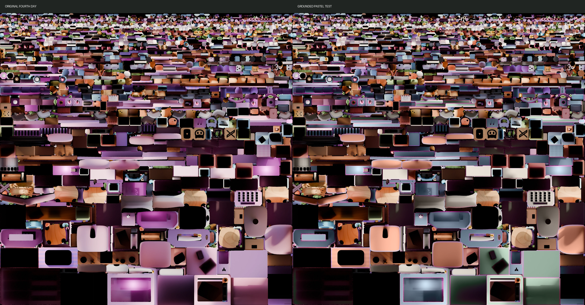

# Báo cáo review Grounded Pastel — NO-REBAKE / Fourth Day

Ngày thực hiện: 2026-09-02  
Trạng thái: **DỪNG SAU MỘT ATLAS FOURTH DAY TEST — CHỜ DUYỆT**

## Kết luận ngắn

- Không dùng SimpleBake.
- Không chạy Cycles bake.
- Không sửa GLB, geometry, UV, object name, raycaster, hover/click, camera hoặc animation.
- Không ghi đè bất kỳ atlas production nào.
- Đã tạo 7 mask UV đúng kích thước `4096 × 4096` từ membership và UV thật của atlas Fourth.
- Đã recolor duy nhất Fourth Day bằng CIELAB, giữ kênh luminance và chi tiết baked.
- Đã nối tạm duy nhất `Fourth.day` vào texture test; `Fourth.night` và shader `uMixRatio` giữ nguyên.
- `npm run build`: **PASS**.
- Trang local, texture test và Fourth Night đều trả `HTTP 200`.
- Môi trường Codex không có browser runtime khả dụng, vì vậy render WebGL trong scene chưa được quan sát trực tiếp. Ảnh atlas, mask và overlay đã được kiểm tra; bước nhìn cuối trong room cần review thủ công tại `http://127.0.0.1:5173/`.

## 1. Atlas membership audit

Nguồn đối chiếu mạnh nhất là collection `SimpleBake_Bakes` trong `For Export.blend`, material bake cuối của từng mesh và UV layer `SimpleBake`. Object name chỉ được dùng để nối baked mesh về source mesh/material.

### Tổng quan bốn atlas

#### First — 24 mesh

`Clock`, `Cube.009`, `Cube.016`, `Cube.018`, `Cube.019`, `Cube.020`, `Cube.021`, `Cube.027`, `Cube.028`, `Cube.036`, `Cube.037`, `Cube.039`, `Cube`, `Lamp`, `Plane.001`, `Plane.003`, `Plane.037`, `Plane.039`, `Plane.040`, `Plane.041`, `Plane.063`, `Plane.064`, `Torus.001`, `Vert.012`.

#### Second — 5 mesh

`Backdrop`, `Plane.042`, `Plane.045`, `Plane.047`, `Plane.122`.

#### Third — 33 mesh

`Kirby`, `League_Logo`, `Microphone`, `Mossy Rock_2`, `Mossy Rock_3.001`, `Mossy Rock_3`, `Mossy Rock_4.001`, `Mossy Rock_4.002`, `Mossy Rock_4`, `Mossy Rock`, `Piano`, `Plane.004`, `Plane.006`, `Plane.016`, `Plane.017`, `Plane.018`, `Plane.019`, `Plane.067`, `Plane`, `Seaweed_10`, `Seaweed_1`, `Seaweed_2`, `Seaweed_3`, `Seaweed_4`, `Seaweed_5`, `Seaweed_6.001`, `Seaweed_6`, `Seaweed_7`, `Seaweed_8`, `Seaweed_9`, `Seaweed`, `Wire_Two`, `Wooden_Name.001`.

#### Fourth — 104 mesh

`Boba plushie`, `Box_1`, `Box_2`, `Box_3`, `BézierCurve.001`, `BézierCurve.002`, `BézierCurve.003`, `BézierCurve.005`, `BézierCurve.010`, `BézierCurve`, `Chair Legs`, `Chair Top`, `Circle.001`, `Computer`, `Cube.002`, `Cube.003`, `Cube.004`, `Cube.005`, `Cube.006`, `Cube.007`, `Cube.008`, `Cube.010`, `Cube.011`, `Cube.012`, `Cube.014`, `Cube.015`, `Cube.017`, `Cube.022`, `Cube.023`, `Cylinder.001`, `Cylinder.007`, `Cylinder.009`, `Cylinder.010`, `Cylinder.012`, `Cylinder.013`, `Cylinder.014`, `Cylinder.015`, `Cylinder`, `Egg Basket`, `Egg One`, `Egg Three`, `Egg Two`, `Flower_Basket`, `GitHub`, `Lights.002`, `Lights.003`, `Lights.004`, `Lights.005`, `Lights.006`, `Lights.007`, `Lights.008`, `Lights.009`, `Lights.010`, `Lights`, `Plane.002`, `Plane.005`, `Plane.007`, `Plane.008`, `Plane.009`, `Plane.010`, `Plane.011`, `Plane.012`, `Plane.013`, `Plane.014`, `Plane.015`, `Plane.020`, `Plane.024`, `Plane.025`, `Plane.026`, `Plane.027`, `Plane.028`, `Plane.030`, `Plane.031`, `Plane.032`, `Plane.033`, `Plane.038`, `Plane.043`, `Plane.044`, `Plane.046`, `Plane.048`, `Plane.073`, `Plane.074`, `Plane.075`, `Plane.105`, `Roundcube.001`, `Roundcube.002`, `Slippers`, `Sticky_Note_1`, `Sticky_Note_2`, `Sticky_Note_3`, `Sticky_Note_4`, `Sticky_Note_5`, `Sticky_Note_6`, `Sticky_Note_7`, `Sticky_Note_8`, `Sticky_Note_9`, `Sticky_Note`, `Table Stand`, `Twitter`, `Vert.002`, `Vert.004`, `Vert.009`, `Wire`, `YouTube`.

Audit object/material đầy đủ, gồm material slot, polygon count, UV layer, bounds và source fallback:

- [`fourth-atlas-source-audit.json`](../artifacts/grounded-pastel-no-rebake/fourth-atlas-source-audit.json)
- [`fourth-recolor-uv-polygons.json`](../artifacts/grounded-pastel-no-rebake/fourth-recolor-uv-polygons.json)

## 2. Object/material được recolor và được giữ nguyên

### Final mapping cho Fourth Day test

| Original material/object | Target color family | Hex |
| --- | --- | --- |
| `Plane.030` / `Drawer` | Sage Green | `#718E7A` |
| `Plane.031` / `Drawer Shelves.001` | Warm Cream | `#F1E9DE` |
| `Computer` / `Computer.001` | Dusty Blue | `#8FA9B8` |
| `Plane.020` / computer body, glass, exhaust và purple trim | Dusty Blue; bảo vệ pixel screen/glass rất tối | `#8FA9B8` |
| `Chair Top` / `Base Gray.001` | Warm Cream | `#F1E9DE` |
| `Chair Legs` / `Base Gray.001` | Warm Cream | `#F1E9DE` |
| `Chair Top` / `Chair Cushion` | Soft Terracotta | `#D99478` |
| `Cube.002` / `Desk Pad` | Soft Terracotta | `#D99478` |
| `Cube.003` / `Keyboard` body | Warm Cream | `#F1E9DE` |

### Cố ý không recolor trong Fourth Day test

- Natural wood: `Wood`, `Light Wooden.001`, `Table Stand`, wood frame của GitHub/YouTube/Twitter.
- Books và paper/poster: `Book Cover One/Two/Four`, `Book Pages`, `Motivatonal`, `Paper`.
- Plants/flowers: `Plant Stem`, `Daylily`, `Lily`, `Hanging Plant`, cactus và flower basket.
- Toys và small props: Boba, boxes, eggs, slippers, rabbit, fish, headphones, speakers, sticky notes, social logos và string lights.
- Keyboard keys: `Plane.002` và `Plane.005` được giữ nguyên để không mất multicolor/key contrast.
- `Lamp` thuộc atlas First, không thuộc Fourth nên không được đưa vào test này.
- `Room`/large room shell không thuộc atlas Fourth nên không được đưa vào test này.

## 3. Mask đã tạo

Tất cả mask có kích thước `4096 × 4096`, white = target, black = untouched. Mask được rasterize supersampling 2× rồi downsample Lanczos để có cạnh antialias.

| Group | Mask | Core coverage | Debug overlay |
| --- | --- | ---: | --- |
| Drawer | [`fourth-mask-drawer.png`](../public/textures/room/grounded-pastel-test/masks/fourth-mask-drawer.png) | 7.571954% | [`overlay`](../public/textures/room/grounded-pastel-test/debug/fourth-debug-drawer-overlay.png) |
| Drawer Shelves | [`fourth-mask-drawer-shelves.png`](../public/textures/room/grounded-pastel-test/masks/fourth-mask-drawer-shelves.png) | 6.376964% | [`overlay`](../public/textures/room/grounded-pastel-test/debug/fourth-debug-drawer-shelves-overlay.png) |
| Computer | [`fourth-mask-computer.png`](../public/textures/room/grounded-pastel-test/masks/fourth-mask-computer.png) | 14.372414% | [`overlay`](../public/textures/room/grounded-pastel-test/debug/fourth-debug-computer-overlay.png) |
| Chair body | [`fourth-mask-chair-body.png`](../public/textures/room/grounded-pastel-test/masks/fourth-mask-chair-body.png) | 3.999722% | [`overlay`](../public/textures/room/grounded-pastel-test/debug/fourth-debug-chair-body-overlay.png) |
| Chair Cushion | [`fourth-mask-chair-cushion.png`](../public/textures/room/grounded-pastel-test/masks/fourth-mask-chair-cushion.png) | 3.706539% | [`overlay`](../public/textures/room/grounded-pastel-test/debug/fourth-debug-chair-cushion-overlay.png) |
| Desk Pad | [`fourth-mask-desk-pad.png`](../public/textures/room/grounded-pastel-test/masks/fourth-mask-desk-pad.png) | 1.877481% | [`overlay`](../public/textures/room/grounded-pastel-test/debug/fourth-debug-desk-pad-overlay.png) |
| Keyboard body | [`fourth-mask-keyboard-body.png`](../public/textures/room/grounded-pastel-test/masks/fourth-mask-keyboard-body.png) | 0.594366% | [`overlay`](../public/textures/room/grounded-pastel-test/debug/fourth-debug-keyboard-body-overlay.png) |

Validation mask:

- Core overlap giữa các mask: `0 pixel`.
- Không chọn wood/books/posters/plants/toys trong group recolor.
- Pixel ngoài union mask sau encode/decode lossless: `0 pixel khác source`.

## 4. Recolor method

Test atlas:

- [`fourth-texture-set-day-grounded-test.webp`](../public/textures/room/grounded-pastel-test/fourth-texture-set-day-grounded-test.webp)

Phương pháp:

1. Decode original Fourth Day production atlas sang sRGB.
2. Chuyển sang CIELAB.
3. Giữ nguyên kênh `L` của từng pixel để bảo toàn baked lighting, shadow, AO, highlight và local contrast.
4. Blend riêng hai kênh `a/b` về target palette theo từng UV mask; không phủ flat color và không multiply RGB.
5. Dùng smoothstep ở `L = 4..18` để bảo vệ true black, screen và glass rất tối.
6. Giữ pixel ngoài mask đúng nguyên bản.
7. Xuất test thành lossless WebP RGB; không thay file production.

## 5. Original vs recolored

- [`fourth-day-original-vs-grounded-test.png`](../public/textures/room/grounded-pastel-test/debug/fourth-day-original-vs-grounded-test.png)



## 6. Image quality result

| Check | Result |
| --- | --- |
| Dimensions | `4096 × 4096` → `4096 × 4096` |
| Color mode / transparency | RGB → RGB; không tạo alpha mới |
| Mask overlap | `0 pixel` |
| Pixel ngoài mask | `0 mismatch` |
| Black pixels | `2,035,143` trước và sau |
| New black pixels | `0` |
| Luminance MAE theo group | `0.052311` đến `0.127251` trên thang Lab L 0–100 |
| Luminance correlation theo group | `0.999966571` đến `0.999996999` |
| Wood | Không nằm trong mask; pixel ngoài mask giữ nguyên tuyệt đối |
| Books/posters/toys/small props | Không nằm trong mask recolor |
| Production Fourth Day hash | Không đổi: `FF57DF8BF1630C4DE37888351FF914177ED429A1E08FDC3788F08D0769B74546` |
| Test atlas hash | `976965082C2FAFA4F865B54BA35AC21B04DE7435142CE3051049D547FC92EE8F` |

Metric đầy đủ:

- [`fourth-day-test-metrics.json`](../artifacts/grounded-pastel-no-rebake/fourth-day-test-metrics.json)

Không phát hiện seam/bleeding mới ở cấp ảnh và mask. Việc xác nhận seam cuối cùng khi texture nằm trên mesh WebGL vẫn cần quan sát trực tiếp trong room vì browser runtime của Codex không khả dụng ở phiên này.

## 7. Temporary textureMap change

Chỉ thay một đường dẫn:

```diff
 Fourth: {
-  day: "/textures/room/day/fourth-texture-set-day.webp",
+  day: "/textures/room/grounded-pastel-test/fourth-texture-set-day-grounded-test.webp",
   night: "/textures/room/night/fourth-texture-set-night.webp",
 }
```

Shader vẫn là:

```glsl
vec3 finalColor = mix(dayColor, nightColor, uMixRatio);
```

Không thêm global recolor/tint uniform và không recolor per-mesh trong Three.js.

## 8. Local preview và build

Local URL: `http://127.0.0.1:5173/`

HTTP verification:

- Page: `200 text/html`, 32,299 bytes.
- Fourth Day test: `200 image/webp`, 7,860,872 bytes.
- Fourth Night production: `200 image/webp`, 1,018,088 bytes.

`npm run build`: **PASS**.

Build vẫn có hai warning có sẵn từ trước:

- `eval` trong `src/main.js`.
- JavaScript chunk lớn hơn 500 kB.

Không có build error liên quan texture test.

## 9. Production integrity

So với backup `backups/grounded-pastel-phase1-2026-09-01/`:

- 8/8 production Day/Night atlas: hash khớp.
- `Before Baking.blend`: hash khớp.
- `For Export.blend`: hash khớp.
- `For Night Time Baking.blend`: hash khớp.
- Tổng: **11/11 production files không đổi**.

Không sửa production GLB.

## 10. Changed files của phase NO-REBAKE này

### Source tạm cho local preview

- `src/main.js` — chỉ đổi `Fourth.day` sang test path.

### Test assets

- `public/textures/room/grounded-pastel-test/fourth-texture-set-day-grounded-test.webp`
- `public/textures/room/grounded-pastel-test/masks/` — 7 mask PNG.
- `public/textures/room/grounded-pastel-test/debug/` — 7 overlay PNG và 1 ảnh comparison.

### Audit và reproducible scripts

- `scripts/blender/audit_fourth_atlas_source.py`
- `scripts/blender/export_fourth_recolor_uv_data.py`
- `scripts/generate_grounded_pastel_fourth_test.py`
- `artifacts/grounded-pastel-no-rebake/fourth-atlas-source-audit.json`
- `artifacts/grounded-pastel-no-rebake/fourth-recolor-uv-polygons.json`
- `artifacts/grounded-pastel-no-rebake/fourth-day-test-metrics.json`
- `docs/grounded-pastel-no-rebake-fourth-day-review.md`

`dist/` được Vite tạo lại để validation nhưng là generated/ignored output.

## 11. Uncertain assignments / giới hạn cần review

1. `Plane.002` thuộc Fourth baked atlas nhưng không còn trong `Before Baking.blend`. Object tương ứng tồn tại trong `For Night Time Baking.blend`, có 1,460 polygon, material `Base White.002` và nằm cùng khu vực keyboard. Nó được xác định là phần keyboard keys và **cố ý loại khỏi recolor**.
2. `Plane.020` có 2,366 source polygons nhưng baked copy có 2,439 polygons. Để không dùng UV lỗi/thừa đoán từ source, computer mask dùng toàn bộ canonical UV của chính `Plane.020_Baked`; pixel screen/glass rất tối được bảo vệ bằng luminance gate.
3. `Room` và `Lamp` không thuộc Fourth, vì vậy chưa đổi trong test atlas này.
4. Browser runtime của Codex trả danh sách browser rỗng. Đường dẫn và asset đã xác minh HTTP 200, nhưng alignment/seam trong render room cần bạn mở local URL và nhìn trực tiếp trước khi duyệt.

## 12. Điểm dừng an toàn

Đã dừng đúng scope:

- Chưa recolor First.
- Chưa recolor Second.
- Chưa recolor Third.
- Chưa recolor bất kỳ Night atlas nào.
- Chưa ghi đè production texture.
- Chưa sửa GLB/Blender production.

Chỉ tiếp tục các atlas còn lại sau khi bạn duyệt Fourth Day test này.
